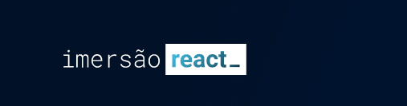
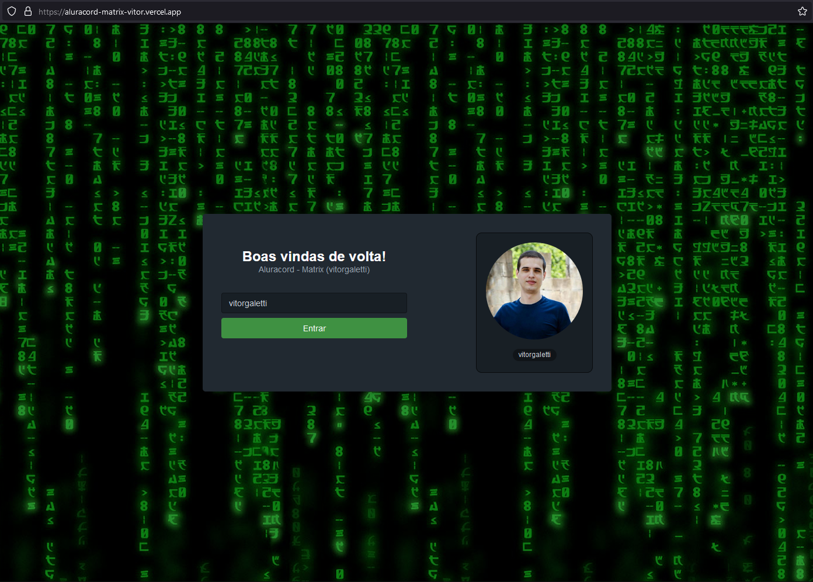
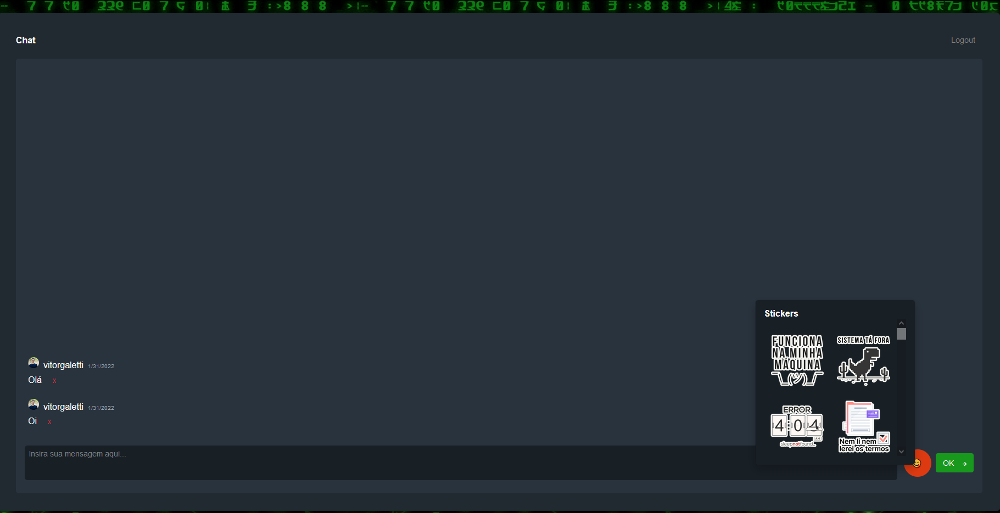

# aluracord-matrix

<p align="center">


</p>

<br>

<p align="center"><em>Confira o resultado do projeto em: <a href="https://aluracord-matrix-vitor.vercel.app/" target="_blank">aluracord-matrix-vitor.vercel.app/</a></em></p>

<hr>

Aluracord-matrix é um chat, onde é possível enviar e receber mensagens, stickers em tempo real.
Basta efetuar o login com o github e usá-lo.

## Imagens

<div>
   
   
</div>

## :rocket: Techs

<ul>
  <li> HTML</li>
  <li> CSS in JS </li>
  <li> SkynexUI  </li>
  <li> Javascript </li>
  <li> ReactJS </li>
  <li> Next.js </li>
  <li> Supabase </li>

</ul>

## Desenvolvimento

---

### Pré-requisitos

- Instalar [Node.js](https://nodejs.org)

- Instalar [Yarn](https://yarnpkg.com/)

### Clone o repositório

```bash
$ git@github.com:vitorgaletti/aluracord-matrix.git
```

### Executar Projeto

```bash
# Mudar para directório
$ cd  aluracord-matrix/
```

- Instalar dependências

```bash
$ yarn
```

- Execute

```bash
$ yarn dev
```

- Executar scripts

|          Ação          |  Utilização  |
| :--------------------: | :----------: |
|   Iniciar o servidor   |  `yarn dev`  |
| Compilar para produção | `yarn build` |
